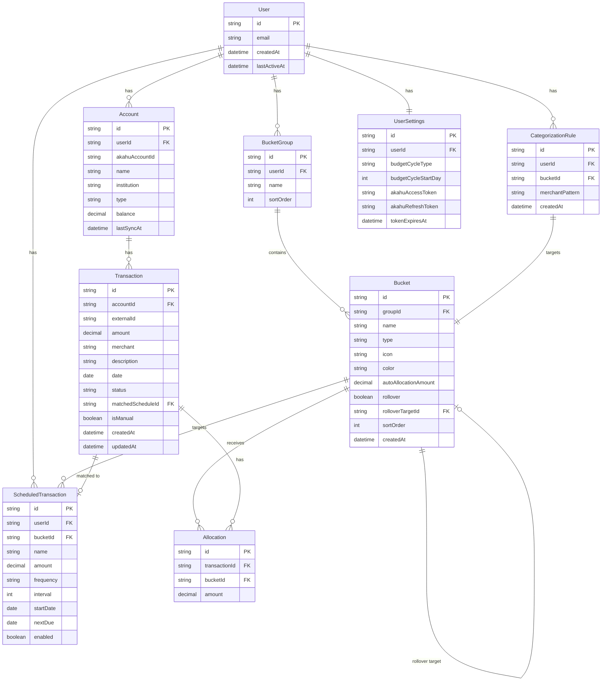
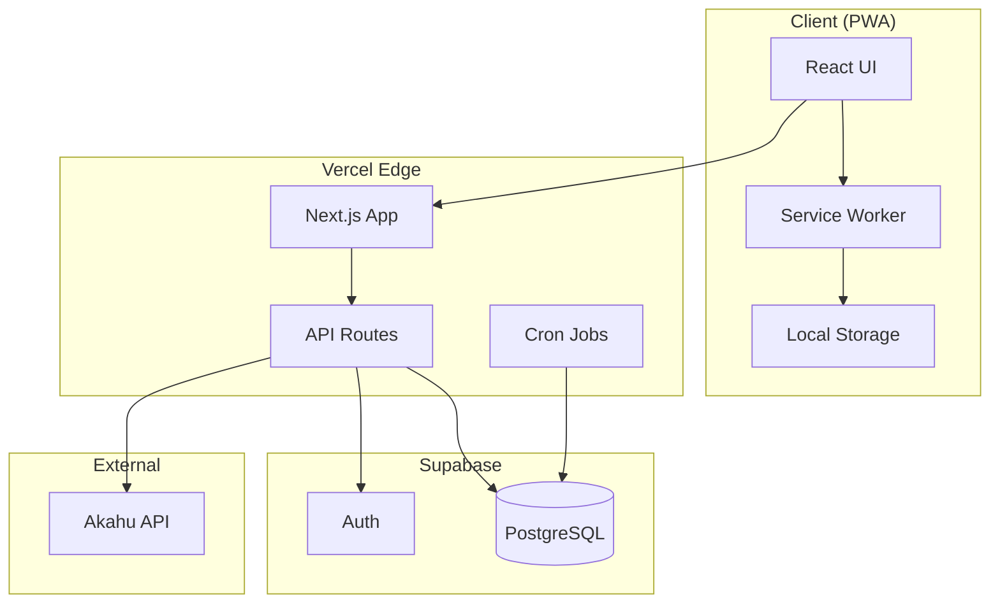
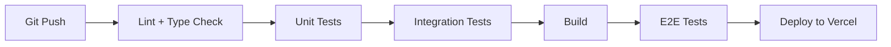

# 🐱 Bucket Budget - Product Specification

A bucket-based personal budgeting application with playful "cash stuffing" mechanics, bank integration via Akahu, and a mobile-first PWA experience.

---

## Table of Contents

1. [Overview](#overview)
2. [User Experience](#user-experience)
3. [Feature Requirements](#feature-requirements)
4. [Data Models](#data-models)
5. [Architecture](#architecture)
6. [API Design](#api-design)
7. [Testing Strategy](#testing-strategy)
8. [Security & Privacy](#security--privacy)
9. [Deployment & Hosting](#deployment--hosting)

---

## Overview

### Vision

A delightful, mobile-first budgeting app that makes managing money feel playful and rewarding. Uses a bucket-based (envelope) system where every dollar has a job.

### Core Principles

- **Every transaction must be allocated** - No orphaned transactions
- **Visual, tactile money management** - Cash stuffing with cute cat piggy banks
- **Proactive awareness** - Calendar shows upcoming expenses, buckets show reserved amounts
- **Graceful degradation** - Works even when bank sync is unavailable

### Target User

- Single user (personal use)
- Based in New Zealand
- Uses multiple bank accounts
- Paid fortnightly (configurable)

---

## User Experience

### Mobile-First PWA

- Installable as a home screen app
- Smooth 60fps animations
- Touch-optimized interactions
- Offline-capable for viewing (sync when online)

### Visual Design Language

#### Cat Piggy Bank Buckets

- Each bucket is represented as a cute cat-face shaped piggy bank
- Fill level visually represents balance vs. budget
- Satisfying sparkle animation when allocating money
- Buckets can be grouped into configurable categories

#### Cash Stuffing Experience

The allocation flow should feel like a delightful game:

1. **Income arrives** → Unallocated pool appears at top
2. **Auto-allocation runs** → Money flows into buckets with predefined amounts (animated)
3. **Manual allocation** → Two modes:
   - **Drag & Drop**: Drag money from pool into a cat piggy bank → allocates that bucket's pre-configured top-up amount → sparkle animation
   - **Quick Allocate All**: Single button that allocates pre-configured top-up amounts to ALL buckets at once → cascading sparkle animation across all buckets
4. **Completion celebration** → Confetti animation when unallocated = $0

#### Color & Theme

- Modern, vibrant palette
- Dark mode support
- Glassmorphism elements where appropriate
- Micro-animations for all interactions

---

## Feature Requirements

### 1. Bank Integration (Akahu)

#### Connection

- OAuth flow to connect bank accounts
- Support for multiple bank accounts
- Read-only token scope
- Tokens stored securely server-side

#### Sync Behavior

- **On-demand only** (pull to refresh)
- Minimum 1 hour between syncs (Akahu free tier limit)
- Graceful handling of sync failures (warning banner, app continues working)

#### Transaction Handling

- Fetch new transactions on sync
- Detect amended/removed transactions:
  - If allocated to single bucket: keep allocation, notify user
  - If split across buckets: unallocate, notify user
- Pending transactions are shown but clearly marked

### 2. Bucket System

#### Bucket Properties

| Property        | Description                                           |
| --------------- | ----------------------------------------------------- |
| Name            | User-defined name                                     |
| Group           | Parent category (configurable)                        |
| Type            | `spending` or `savings`                               |
| Icon            | Selected cat variant or emoji                         |
| Color           | Accent color                                          |
| Auto-allocation | Amount to auto-allocate on income                     |
| Rollover        | Boolean - does unspent money roll over?               |
| Rollover Target | If rollover=false, which bucket receives reset money? |

#### Bucket Groups

- User-defined groups (e.g., "Essentials", "Lifestyle", "Savings")
- Drag-and-drop reordering
- Collapse/expand groups

#### Bucket Behavior

- **Spending buckets**: Regular expenses, optionally roll over
- **Savings buckets**: Always accumulate, displayed differently (goal progress)
- **Overspending**: Warn but allow (bucket goes negative, prominent visual warning)

#### Available to Budget

- Income minus all bucket allocations
- Prominently displayed
- Cannot be negative (blocks allocation)

### 3. Transaction Management

#### Transaction Sources

1. **Bank sync** (via Akahu)
2. **Manual entry**
3. **Scheduled transaction instances**

#### Transaction States

```
┌─────────────┐    ┌─────────────┐    ┌─────────────┐
│   Pending   │ →  │  Allocated  │    │  Amended    │
│  (in inbox) │    │ (to bucket) │    │  (flagged)  │
└─────────────┘    └─────────────┘    └─────────────┘
```

#### Auto-Categorization

- When manually allocating a transaction, option to "Always allocate [merchant] to [bucket]"
- Rule stored: merchant name → bucket
- Future transactions auto-allocated if rule matches
- Falls back to inbox if no rule matches

#### Split Transactions

- Allocate portions of a transaction to different buckets
- Visual indicator showing split status
- Sum of splits must equal transaction amount

#### Transaction Fields

| Field             | Description                             |
| ----------------- | --------------------------------------- |
| id                | Unique identifier                       |
| externalId        | Akahu transaction ID (nullable)         |
| amount            | Transaction amount (negative = outflow) |
| merchant          | Merchant name                           |
| description       | Full description from bank              |
| date              | Transaction date                        |
| accountId         | Source bank account                     |
| status            | `pending` \| `cleared` \| `amended`     |
| allocations       | Array of {bucketId, amount}             |
| matchedScheduleId | If matched to scheduled transaction     |
| isManual          | True if manually entered                |
| createdAt         | Creation timestamp                      |
| updatedAt         | Last update timestamp                   |

### 4. Scheduled Transactions

#### Purpose

- Reserve money in buckets for upcoming expenses
- Visual representation in calendar
- Auto-match with actual bank transactions

#### Schedule Configuration

| Property  | Description                                                    |
| --------- | -------------------------------------------------------------- |
| name      | Description (e.g., "Power Bill")                               |
| amount    | Expected amount                                                |
| bucketId  | Target bucket                                                  |
| frequency | `weekly` \| `fortnightly` \| `monthly` \| `yearly` \| `custom` |
| interval  | For custom: every X periods                                    |
| startDate | When schedule begins                                           |
| nextDue   | Next expected date                                             |
| enabled   | Active/inactive                                                |

#### Auto-Matching

- When bank transaction arrives within ±10% of scheduled amount
- Near expected date (configurable tolerance, default ±3 days)
- Same bucket allocation
- Auto-link and mark schedule instance as fulfilled

#### Bucket Balance Display

Buckets show two values:

- **Available now**: Balance minus upcoming scheduled amounts
- **Total balance**: Full balance including reserved

### 5. Calendar View

#### Display

- Weekly view as default
- Swipe to navigate weeks
- Navigate multiple weeks ahead

#### Content

- Scheduled transactions (upcoming bills)
- Pay days
- Color-coded by bucket group

#### Interaction

- Tap entry to view/edit scheduled transaction
- Visual distinction between fulfilled and pending

### 6. Budget Periods

#### Configuration

- **Cycle type**: `weekly` | `fortnightly` | `monthly` | `custom`
- **Start day**: Configurable (e.g., payday)
- Stored in user settings

#### Period Boundary Behavior

At start of new period:

1. For rollover=false buckets: move balance to target bucket
2. Apply auto-allocations to all buckets with them configured
3. Reset period counters

### 7. Reporting & Analytics

#### Spending Analysis

- View spending by:
  - Single bucket
  - Bucket group
  - All buckets combined
- Time window: configurable (week, month, quarter, year, custom range)

#### Visualizations

- Bar charts for spending over time
- Category breakdowns
- Trend lines

### 8. Data Export

#### Format

- **JSON**: Complete data export (all fields, relationships)
- **CSV**: Simplified for spreadsheet analysis

#### Scope

- All transactions
- All buckets
- All rules
- All scheduled transactions

### 9. Notifications

#### Types

- **Uncategorized transactions**: "You have X transactions to allocate"
- **Upcoming scheduled**: "Rent due in 3 days"
- **Overspending**: "You've overspent on Dining Out by $X"

#### Delivery

- Push notifications (PWA)
- Badge on app icon

---

## Data Models

### Entity Relationship Diagram



### Key Relationships

1. **Transaction ↔ Allocation**: One-to-many (split transactions)
2. **Transaction ↔ ScheduledTransaction**: Optional one-to-one match
3. **Bucket ↔ Bucket**: Self-referential for rollover targets
4. **Account ↔ Transaction**: One-to-many

---

## Architecture

### Tech Stack

| Layer           | Technology      | Version | Rationale                                |
| --------------- | --------------- | ------- | ---------------------------------------- |
| **Framework**   | Next.js         | 16.1.x  | App Router, RSC, API routes, PWA support |
| **UI Library**  | React           | 19.x    | Server Components, React Compiler        |
| **Database**    | PostgreSQL      | 15+     | Relational data, ACID, via Supabase      |
| **ORM**         | Prisma          | 7.2.x   | Type-safe, great DX, ESM-first           |
| **Styling**     | Tailwind CSS    | 4.x     | CSS-first config, fast builds            |
| **Animations**  | Motion (Framer) | 12.x    | Drag-drop, spring physics, gestures      |
| **Auth**        | Supabase Auth   | -       | Magic link built-in                      |
| **Testing**     | Vitest          | 4.0.x   | Fast, browser mode, visual regression    |
| **E2E Testing** | Playwright      | 1.57.x  | Cross-browser, reliable                  |

### System Architecture



### Key Architectural Decisions

#### 1. Server Components for Data Fetching

- Bucket lists, transaction lists fetched server-side
- Reduces client bundle, faster initial load

#### 2. Client Components for Interactivity

- Drag-drop allocation
- Calendar navigation
- Form inputs

#### 3. Optimistic Updates

- Allocation changes appear immediately
- Rollback on server error

#### 4. PWA Strategy

- Service worker caches shell and static assets
- IndexedDB for offline transaction viewing
- Background sync when online

---

## API Design

### REST Endpoints

#### Accounts

| Method | Path                     | Description             |
| ------ | ------------------------ | ----------------------- |
| GET    | `/api/accounts`          | List connected accounts |
| POST   | `/api/accounts/connect`  | Initiate Akahu OAuth    |
| POST   | `/api/accounts/callback` | Akahu OAuth callback    |
| POST   | `/api/accounts/:id/sync` | Trigger manual sync     |
| DELETE | `/api/accounts/:id`      | Disconnect account      |

#### Buckets

| Method | Path                   | Description                    |
| ------ | ---------------------- | ------------------------------ |
| GET    | `/api/buckets`         | List all buckets with balances |
| POST   | `/api/buckets`         | Create bucket                  |
| PATCH  | `/api/buckets/:id`     | Update bucket                  |
| DELETE | `/api/buckets/:id`     | Delete bucket                  |
| POST   | `/api/buckets/reorder` | Reorder buckets                |

#### Bucket Groups

| Method | Path                     | Description  |
| ------ | ------------------------ | ------------ |
| GET    | `/api/bucket-groups`     | List groups  |
| POST   | `/api/bucket-groups`     | Create group |
| PATCH  | `/api/bucket-groups/:id` | Update group |
| DELETE | `/api/bucket-groups/:id` | Delete group |

#### Transactions

| Method | Path                      | Description                    |
| ------ | ------------------------- | ------------------------------ |
| GET    | `/api/transactions`       | List transactions (filterable) |
| GET    | `/api/transactions/inbox` | Unallocated transactions       |
| POST   | `/api/transactions`       | Create manual transaction      |
| PATCH  | `/api/transactions/:id`   | Update transaction             |
| DELETE | `/api/transactions/:id`   | Delete (manual only)           |

#### Allocations

| Method | Path                             | Description           |
| ------ | -------------------------------- | --------------------- |
| POST   | `/api/transactions/:id/allocate` | Allocate to bucket(s) |
| DELETE | `/api/transactions/:id/allocate` | Remove allocation     |

#### Scheduled Transactions

| Method | Path                 | Description                  |
| ------ | -------------------- | ---------------------------- |
| GET    | `/api/scheduled`     | List scheduled transactions  |
| POST   | `/api/scheduled`     | Create scheduled transaction |
| PATCH  | `/api/scheduled/:id` | Update scheduled             |
| DELETE | `/api/scheduled/:id` | Delete scheduled             |

#### Rules

| Method | Path             | Description               |
| ------ | ---------------- | ------------------------- |
| GET    | `/api/rules`     | List categorization rules |
| POST   | `/api/rules`     | Create rule               |
| DELETE | `/api/rules/:id` | Delete rule               |

#### Reporting

| Method | Path                    | Description                   |
| ------ | ----------------------- | ----------------------------- |
| GET    | `/api/reports/spending` | Spending by bucket/group/time |
| GET    | `/api/export`           | Export all data (JSON/CSV)    |

#### Settings

| Method | Path            | Description       |
| ------ | --------------- | ----------------- |
| GET    | `/api/settings` | Get user settings |
| PATCH  | `/api/settings` | Update settings   |

---

## Testing Strategy

### Philosophy

- **Heavy unit testing** for business logic
- **Integration tests** for API endpoints
- **E2E tests** for critical user flows
- **Test harness authentication** via test-specific Supabase auth tokens

### Testing Framework Selection

| Type        | Framework  | Rationale                              |
| ----------- | ---------- | -------------------------------------- |
| Unit        | Vitest     | Fast, native ESM, great DX             |
| Integration | Vitest     | Same framework, less context switching |
| E2E         | Playwright | Reliable, great mobile emulation       |

### Unit Tests

#### What to Test

- Bucket balance calculations
- Transaction matching logic (±10% tolerance)
- Auto-categorization rule matching
- Period boundary calculations
- Rollover logic
- Split transaction validation

#### Example Test Cases

```typescript
// Bucket balance calculations
describe('calculateBucketBalance', () => {
  it('sums all allocations for a bucket');
  it('handles split transactions correctly');
  it('excludes pending transactions if configured');
  it('subtracts reserved amounts for scheduled transactions');
});

// Transaction matching
describe('matchScheduledTransaction', () => {
  it('matches within ±10% of expected amount');
  it('matches within date tolerance');
  it('does not match already-matched transactions');
  it('prioritizes closest date when multiple schedules match');
});

// Auto-categorization
describe('applyCategoryRules', () => {
  it('matches exact merchant names');
  it('matches partial merchant names');
  it('returns null when no rules match');
  it('applies first matching rule only');
});
```

### Integration Tests

#### API Endpoint Tests

- Authentication required for all endpoints
- CRUD operations for each resource
- Error handling (invalid input, not found, unauthorized)
- Edge cases (deleting bucket with allocations, etc.)

#### Test Database

- Use Supabase test project or local PostgreSQL
- Seed data per test suite
- Clean up after each test

### E2E Tests (Playwright)

#### Critical Flows

1. **Allocation Flow**
   - Navigate to inbox
   - Allocate transaction to bucket
   - Verify bucket balance updates
   - Verify transaction leaves inbox

2. **Bank Sync Flow**
   - Trigger sync
   - Verify new transactions appear
   - Verify amended transactions flagged

3. **Scheduled Transaction Flow**
   - Create scheduled transaction
   - Verify appears in calendar
   - Verify bucket shows reserved amount

4. **Cash Stuffing Flow**
   - Add income
   - Allocate via drag-drop
   - Verify celebration animation triggers

#### Mobile Testing

- Test on mobile viewport (375x667)
- Test touch gestures (swipe calendar, drag-drop)
- Test PWA installation flow

### Test Authentication

#### Approach

- Supabase provides test tokens via `supabase.auth.signInWithPassword()` for test users
- E2E tests use dedicated test account with known credentials
- Integration tests bypass auth via `supabase.auth.admin.createUser()` + `supabase.auth.admin.generateLink()`

#### Test User Setup

```typescript
// playwright.setup.ts
const testUser = {
  email: 'test@bucketbudget.test',
  password: process.env.TEST_USER_PASSWORD,
};

await supabase.auth.signInWithPassword(testUser);
await page.context().addCookies([...authCookies]);
```

---

## Security & Privacy

### Authentication

- **Method**: Magic link (passwordless)
- **Session duration**: Indefinite until 7 days of inactivity
- **Provider**: Supabase Auth

### Data Protection

- All data encrypted at rest (Supabase default)
- HTTPS only (Vercel enforced)
- Akahu tokens encrypted before storage
- No client-side storage of sensitive tokens

### Akahu Token Handling

- Tokens are read-only scope
- Stored server-side only
- Refresh tokens encrypted with per-user key
- Token refresh handled automatically

### Row-Level Security (RLS)

Supabase RLS policies ensure:

- Users can only access their own data
- All tables protected by default

### Source Control Security

The `.gitignore` must exclude:

- `.env` and `.env.*` files (credentials)
- `*.pem` and `*.key` files (certificates/keys)
- Any local Supabase config with secrets
- IDE-specific files that may contain tokens

---

## Deployment & Hosting

### Infrastructure

| Service      | Role            | Free Tier Limits                      |
| ------------ | --------------- | ------------------------------------- |
| **Vercel**   | Next.js hosting | 100GB bandwidth, serverless functions |
| **Supabase** | Database + Auth | 500MB storage, 50K MAU                |

### Environment Variables

```env
# Supabase
NEXT_PUBLIC_SUPABASE_URL=
NEXT_PUBLIC_SUPABASE_ANON_KEY=
SUPABASE_SERVICE_ROLE_KEY=

# Akahu
AKAHU_APP_TOKEN=
AKAHU_APP_SECRET=
AKAHU_REDIRECT_URI=

# App
NEXT_PUBLIC_APP_URL=
```

### CI/CD Pipeline



### Deployment Checklist

- [ ] Set all environment variables in Vercel
- [ ] Configure Supabase RLS policies
- [ ] Set up Akahu app with correct redirect URI
- [ ] Configure PWA manifest
- [ ] Test magic link emails in production

---

## Future Considerations

These are explicitly out of scope for v1 but noted for potential future development:

- [ ] Multi-currency support
- [ ] Investment account tracking
- [ ] Credit card statement imports
- [ ] Shared household budgeting
- [ ] Bill reminders via SMS
- [ ] Australia Basiq integration
- [ ] Receipt scanning
- [ ] Budget templates

---

## Glossary

| Term                      | Definition                                                          |
| ------------------------- | ------------------------------------------------------------------- |
| **Bucket**                | An envelope/category for allocating money (our term for "envelope") |
| **Allocation**            | Assigning a transaction (or portion) to a bucket                    |
| **Cash Stuffing**         | The playful act of distributing income into buckets                 |
| **Inbox**                 | Transactions awaiting allocation                                    |
| **Scheduled Transaction** | A recurring expected expense                                        |
| **Period**                | A budget cycle (e.g., fortnightly)                                  |

---

_Last updated: January 2026_
